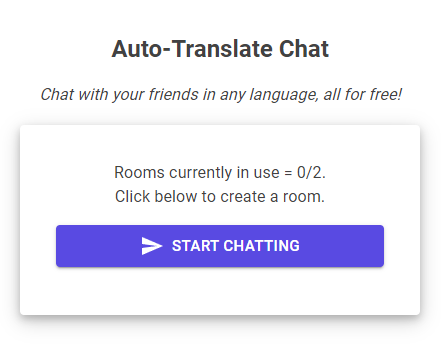
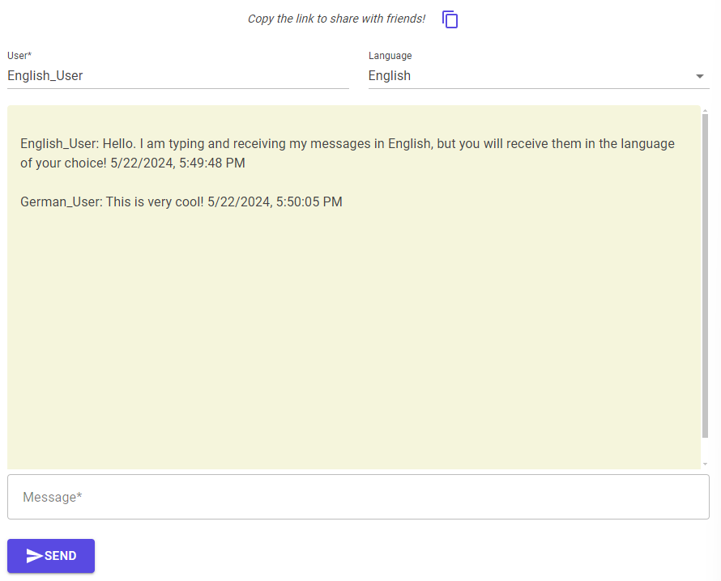
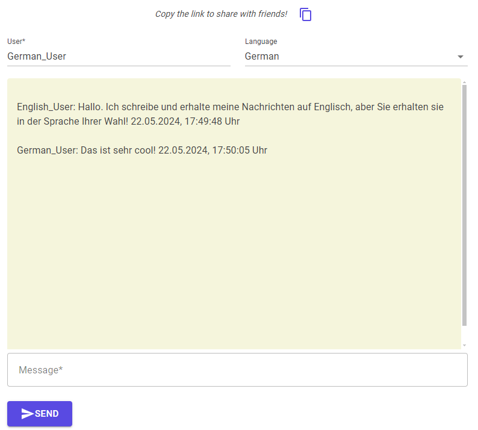

# Auto-Translate Chat

The website is hosted via Azure and can be accessed here: <strong><a href="https://blazorserverchatroom.azurewebsites.net/">Auto-Translate Chat</a></strong>.
 
<i>Note: I may bring the website down at times for cost purposes. If it is down and you want to view it, please contact me.</i>

## Overview

Auto-Translate Chat was inspired by the need to simplify multilingual conversations within my family. We speak three different languages, but only a few of us are trilingual (I am not among them). Often, I had to manually translate messages back and forth, which was time-consuming and cumbersome.

As someone who primarily works on API backend tasks in .NET/C#, I wanted to explore Blazor to see how it could handle a complete application, from front-end to back-end, in C#. Using Blazor Server with SignalR, I developed a real-time chat application that automatically translates messages on the fly using an API powered by Google Translate. The documentation for the API can be viewed <strong><a href="https://github.com/nidhaloff/deep-translator?tab=readme-ov-file">here</a></strong>.

## Key Features

- **Real-Time Translation:**

  - Messages are translated on the fly.
  - Seamless conversation flow without manual translation steps.

- **Shareable Chat Room Links::**

  - Each chat room has a uniquely generated URL.
  - Users can share this link to invite friends to join specific chat rooms effortlessly.

- **Blazor Server with SignalR Integration:**

  - Real-time communication and updates.
  - Efficient handling of chat messages and translations.

- **Unique Chat Room Instances:**

  - Each chat room is a separately spawned instance.
  - Ensures isolation and dedicated resources for each conversation.

- **Connection Manager:**

  - A global ChatRoomManager Singleton oversees all active chat rooms.
  - Manages connections and gracefully closes inactive chat rooms.

## Developer Tools

- **.NET 8.0 Blazor Server**
- **SignalR Client**
- **MudBlazor (UI)**
- **Azure App Service**

## Example Chat

<strong>Screenshots</strong>

  

<i>Create a room to begin chatting and then share the link with your friends.</i>

  

<i>An English user sending and receiving messages from a German user.</i>

  

<i>A German user sending and receiving messages from an English user.</i>

